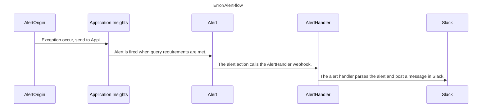

# Code for the blog post: "Send your application errors to Slack!"

## App - AlertOrigin
Minimal API created by the command `dotnet new webapi -minimal`, connected to Application Insights.

The only thing it does is throwing an exception with the message: "This text should appear in Slack!".

## Func - AlertHandler
Contains an HTTP trigger which acts as a webhook that can be used by an Azure Alert action.
The trigger can receive a message in the format of the Common Alert Schema, given by Application Insights.

The alert handler has an implementation of a SlackApi which enables sending messages to a Slack webhook (see blog post for creating a Slack webhook).

The alert is parsed and relevant info (outerMessage) is sent as a part of the message to Slack.

## Flow
